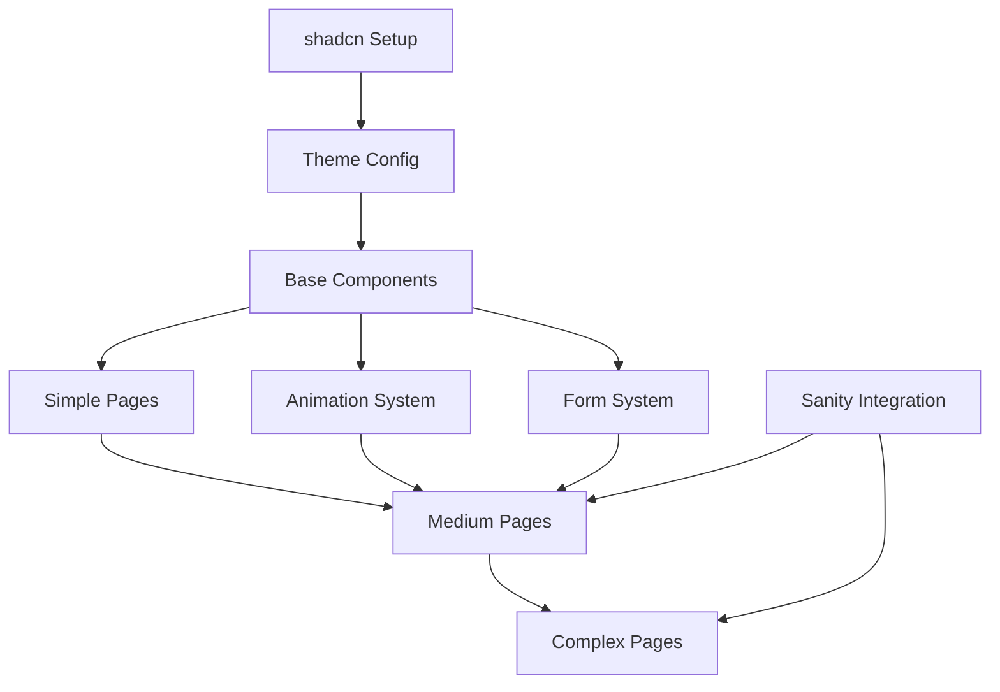

# Page Migration Complexity Matrix - Orange Jelly

## Overview
This matrix provides a detailed complexity assessment for migrating each page template to shadcn/ui, including effort estimates, risk factors, and dependencies.

## Complexity Scoring System

**Complexity Score (1-10)**
- 1-3: Simple (static content, basic components)
- 4-6: Medium (some interactivity, standard patterns)
- 7-10: Complex (heavy interactivity, custom logic, multiple integrations)

**Risk Score (1-5)**
- 1: Low risk (no critical features)
- 2-3: Medium risk (some business features)
- 4-5: High risk (critical business logic/SEO)

## Page-by-Page Complexity Matrix

| Page | Complexity | Risk | Hours | Components | Blockers | Priority |
|------|------------|------|-------|------------|----------|----------|
| **pub-marketing-no-budget** | 3/10 | 2/5 | 8-12h | Hero, Cards, CTA | None | HIGH (pilot) |
| **compete-with-pub-chains** | 3/10 | 2/5 | 8-12h | Similar pattern | None | HIGH |
| **empty-pub-solutions** | 3/10 | 2/5 | 8-12h | Similar pattern | None | HIGH |
| **pub-rescue** | 3/10 | 2/5 | 8-12h | Similar pattern | None | HIGH |
| **quiet-midweek-solutions** | 3/10 | 2/5 | 8-12h | Similar pattern | None | HIGH |
| **404 (not-found)** | 1/10 | 1/5 | 2-4h | Basic layout | None | MEDIUM |
| **Loading** | 1/10 | 1/5 | 2-4h | Skeleton | None | LOW |
| **About** | 5/10 | 3/5 | 16-24h | Timeline, FAQ, Cards | PortableText | MEDIUM |
| **Services** | 5/10 | 3/5 | 16-24h | ServiceCards, Grid | Dynamic imports | HIGH |
| **Contact** | 6/10 | 3/5 | 20-28h | Form, Status, Map | Form validation | HIGH |
| **Blog Listing** | 5/10 | 3/5 | 16-20h | Cards, Categories | Sanity queries | MEDIUM |
| **Blog Post** | 6/10 | 4/5 | 20-24h | TOC, Share, Related | Markdown, SEO | MEDIUM |
| **Category Page** | 4/10 | 2/5 | 12-16h | Card grid | Dynamic routing | LOW |
| **Results** | 8/10 | 4/5 | 32-40h | CaseStudySelector | Complex state | MEDIUM |
| **Home** | 9/10 | 5/5 | 40-48h | ROICalculator, All | Performance critical | LOW |

## Detailed Complexity Factors

### Simple Pages (1-3 Complexity)

#### Content Marketing Pages
**Why Simple:**
- Mostly static content
- Reusable template pattern
- No complex interactions
- Standard animations

**Migration Approach:**
- Create one template, reuse for all
- Simple Card and Badge compositions
- Basic Framer Motion animations

### Medium Pages (4-6 Complexity)

#### About Page (5/10)
**Complexity Factors:**
- Timeline visualization needs custom component
- FAQ with schema markup
- PortableText rendering
- Multiple animation sequences

**Key Challenges:**
- Preserving timeline design
- Maintaining animation timing
- FAQ schema integration

#### Services Page (5/10)
**Complexity Factors:**
- ServiceCard grid with hover states
- Dynamic imports for performance
- Comparison table component
- Process visualization

**Key Challenges:**
- Service comparison needs Table component
- Maintaining card hover effects
- Dynamic import patterns

#### Contact Page (6/10)
**Complexity Factors:**
- Form validation with Zod
- Real-time availability status
- Multiple contact methods
- Map integration

**Key Challenges:**
- Form state management
- Availability component logic
- WhatsApp integration

#### Blog System (4-6/10)
**Complexity Factors:**
- Dynamic routing
- Sanity CMS integration
- SEO schema generation
- Related posts algorithm

**Key Challenges:**
- Preserving SEO features
- Markdown rendering
- Category filtering

### Complex Pages (7-10 Complexity)

#### Results Page (8/10)
**Complexity Factors:**
- Interactive CaseStudySelector
- Complex filtering logic
- Animation sequences
- Data visualization

**Key Challenges:**
- State management for filters
- Smooth transitions
- Performance with large datasets

#### Home Page (9/10)
**Complexity Factors:**
- ROI Calculator with complex logic
- Multiple data sources (Sanity)
- Heavy animations
- Performance critical
- Many component types

**Key Challenges:**
- Calculator state and validation
- Animation performance
- Component composition
- Bundle size optimization

## Migration Dependencies

### Technical Dependencies

### Component Dependencies
1. **Must Complete First:**
   - Button, Card, Input, Badge
   - Section wrapper pattern
   - Animation wrapper

2. **Second Wave:**
   - Form, Accordion, Tabs
   - Grid layout system
   - Hero pattern

3. **Final Wave:**
   - Complex compositions
   - Business logic components
   - Performance optimizations

## Risk Mitigation by Page

### High-Risk Pages (Home, Results)
**Mitigation Strategy:**
- Extensive testing plan
- Feature flags for gradual rollout
- A/B testing critical paths
- Performance monitoring
- SEO impact assessment

### Medium-Risk Pages (Services, Contact, Blog)
**Mitigation Strategy:**
- Component isolation
- Preserve business logic
- Test form submissions
- Verify SEO schemas
- Check responsive behavior

### Low-Risk Pages (Content Marketing, System)
**Mitigation Strategy:**
- Use as learning ground
- Establish patterns
- Document decisions
- Create reusable templates

## Effort Estimation Summary

### By Complexity
- **Simple Pages (7 total)**: 50-80 hours
- **Medium Pages (6 total)**: 100-140 hours
- **Complex Pages (2 total)**: 72-88 hours
- **Integration & Testing**: 40-60 hours
- **Documentation**: 20-30 hours

**Total Estimate**: 282-398 hours (7-10 weeks)

### By Phase
1. **Phase 1 (Simple)**: 1-2 weeks
2. **Phase 2 (Medium)**: 2.5-3.5 weeks
3. **Phase 3 (Complex)**: 2-2.5 weeks
4. **Phase 4 (Polish)**: 1-1.5 weeks

## Priority Recommendations

### Quick Wins (Start Here)
1. Content marketing pages - establish patterns
2. 404/Loading pages - simple practice
3. Services page - high visibility, medium complexity

### Strategic Priorities
1. Contact page - critical for conversions
2. About page - brand story
3. Blog system - SEO important

### Save for Last
1. Home page - most complex, highest risk
2. Results page - complex interactions

## Success Criteria

### Per-Page Success Metrics
- [ ] All functionality preserved
- [ ] Performance maintained/improved
- [ ] SEO rankings unchanged
- [ ] Accessibility compliant
- [ ] Mobile experience intact
- [ ] Animation quality preserved

### Overall Success Metrics
- [ ] 20% bundle size reduction
- [ ] 15% performance improvement
- [ ] 0 SEO regressions
- [ ] 50% code reduction
- [ ] 100% TypeScript coverage

---

**Document Version**: 1.0
**Last Updated**: November 2024
**Status**: Complete